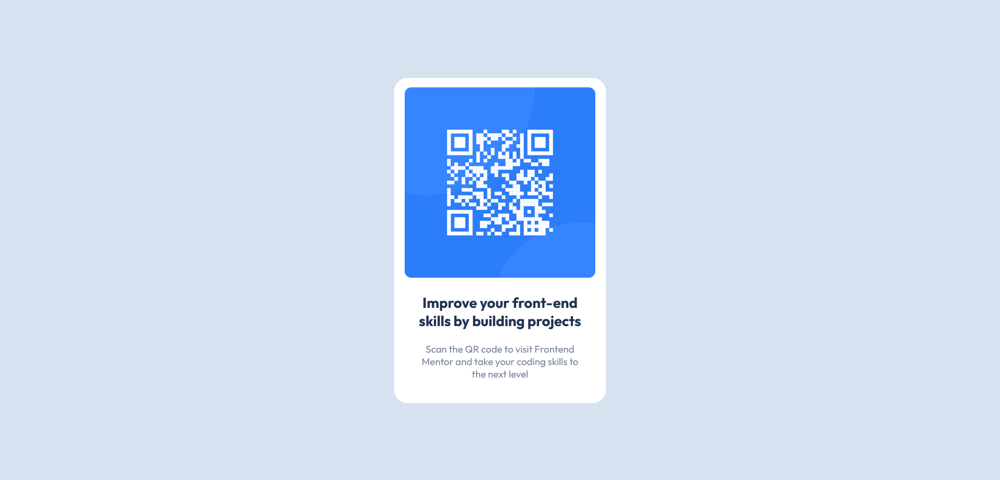

# Frontend Mentor - QR code component solution

This is a solution to the [QR code component challenge on Frontend Mentor](https://www.frontendmentor.io/challenges/qr-code-component-iux_sIO_H). 

## Table of contents

- [Overview](#overview)
  - [Screenshot](#screenshot)
  - [Links](#links)
- [My process](#my-process)
  - [Built with](#built-with)
  - [What I learned](#what-i-learned)
 - [Author](#author)

## Overview

### Screenshot

### Links

- Solution URL: [Github Reop] (https://github.com/jwalczak94/QRcode-component)
- Live Site URL: [Github page](https://jwalczak94.github.io/QRcode-component/)

## My process

### Built with

- VSCode
- Semantic HTML5 markup
- CSS custom properties
- Flexbox

### What I learned

This was my first challenge on the **Frontend Mentor** platform. I used Flexbox to center the QR code box and also variables to make the project more reusable.

## Author

- Website - [J.Walczak](https://github.com/jwalczak94)
- Frontend Mentor - [@jwalczak94](https://www.frontendmentor.io/profile/jwalczak94)
